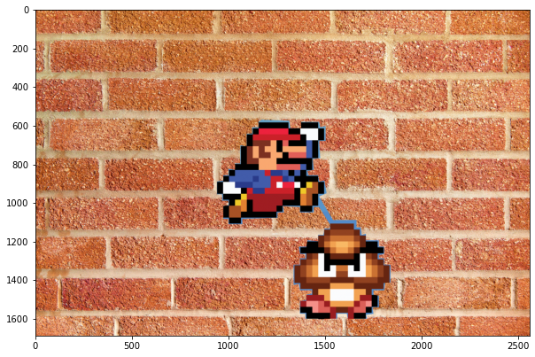
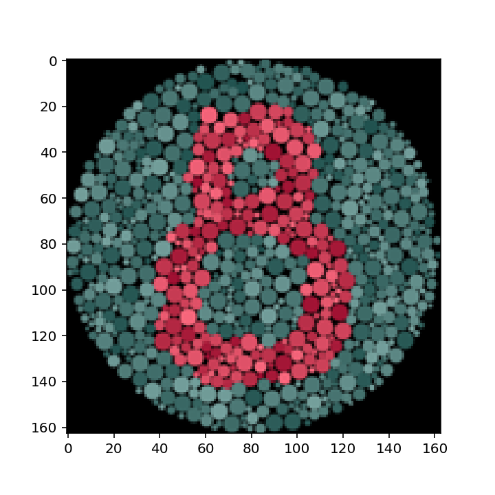
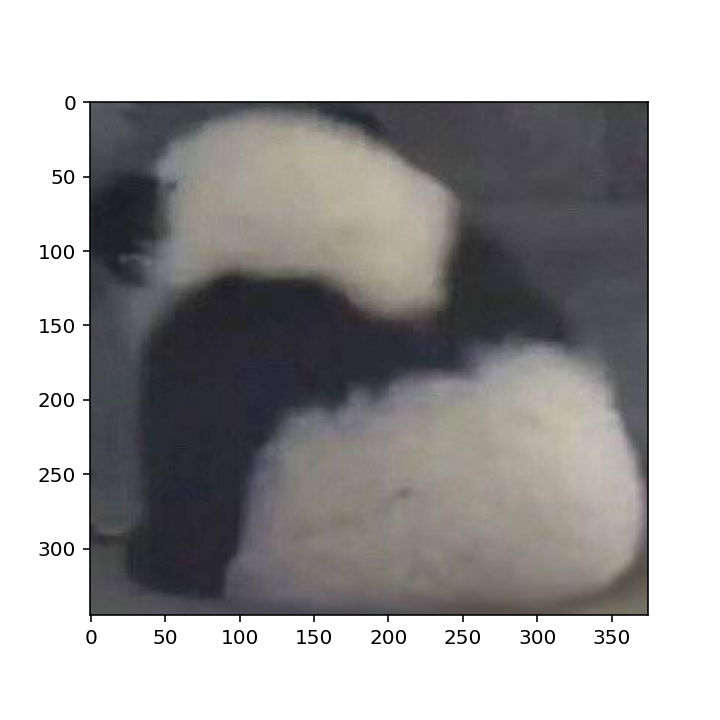

# Gradient Domain Fusion

## Core

### Poisson Blending

#### Original Images

##### Background Image

-   Here is an image I took at Tokyo Airport

##### Object Image

-   Here is the grainger Bob statue near the Grainger Library

#### Pasted image with source pixels directly copied onto target background region

#### Final Blend Result

#### One more good result

##### Direct pasting

##### Poisson Blending

#### One failure case

### Mixed Gradients

#### Original Images

##### Object Image

##### Background Image

#### Pasted image with source pixels directly copied onto target background region

#### Final Blend Result

-   This is the Mixed Blend result, and it looks much natural compared to the Poisson result I presented earlier. In our Poisson blending result, there is a blurred line between the two, but Mixed Blend does not have such issue. In addition to this, both characters also have the texture of the wall and are more transparent, this makes it look like its painted to the wall. 

## Bell & Whistles 

### Color2Gray

-   For my own `Color2Gray` implementation, I have used Gradient domain methods similar to part 3 to preserve the highest gradient out of the red, green, and blue layer at a specific pixel. This allows us to preserve the highest gradient of any of the layer to preserve the original information and project it to the gray image. 

#### Color 4

#### Gray 4

#### Color 8

#### Gray 8

#### Color natural image

#### Gray natural image

-   We can see that the details of the image are preserved well

### Laplacian Pyramid Blending

-   

#### Original Images

##### Background Image

##### Object Image

#### Direct Pasting

#### Poisson Blend

#### Mixed Blend 

#### Laplacian Blending

